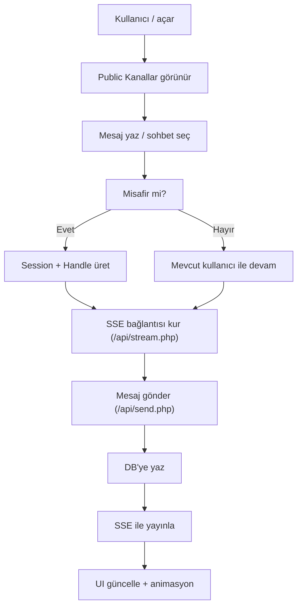

## 1. Ürün Özeti
chat.emrecloud.com.tr üzerinde çalışan, harici servis/API kullanmadan (Firebase/Pusher/Supabase yok), cPanel uyumlu PHP + MySQL + SSE mimarisiyle WhatsApp Web / Telegram kalitesinde modern web mesajlaşma uygulaması.
- Hedef kullanıcılar: Kayıtlı üyeler + giriş yapmadan katılan misafirler (anonim), topluluk kanallarında ve özel sohbetlerde gerçek zamanlı iletişim
- Değer: Tamamen self-hosted; port kısıtları altında bile anlık deneyim; özelleştirilebilir tema/ayar ekosistemi; admin moderasyon ve toplu bildirim altyapısı

## 2. Çekirdek Özellikler

### 2.1 Kullanıcı Rolleri
| Rol | Kayıt Yöntemi | Temel Yetkiler |
|------|----------------|----------------|
| Misafir (Anonim) | Otomatik session + geçici handle | Public kanallara katılma, mesaj yazma, temel ayarları kullanma |
| Üye | E-posta/Şifre veya Telefon + simüle OTP | Kalıcı handle, avatar, 1-1 sohbet başlatma, grup kurma, gelişmiş ayarlar |
| Admin | Rol ataması (DB) | /admin paneli, moderasyon, toplu duyuru/DM, canlı metrikler |

### 2.2 Modül Listesi (Sayfa Bazlı)
1. **Sohbet Uygulaması (index.php)**: Sol sohbet/kanal listesi, ana mesaj alanı, yazma kutusu, üst bar, arama, profil/ayar çekmecesi
2. **Kimlik Doğrulama Akışı (index.php içi modal/sekme + /api/auth.php)**: Üye kayıt, giriş, telefon OTP simülasyonu, misafir session üretimi
3. **Admin Panel (/admin/dashboard.php)**: Toplu yayın/DM, moderasyon, canlı monitor (SSE), kelime filtresi yönetimi

### 2.3 Sayfa Detayları
| Sayfa | Modül | Davranış / Açıklama |
|------|-------|----------------------|
| / (index.php) | Public Kanallar Sekmesi | Varsayılan açılış; misafir kullanıcılar doğrudan burada başlar |
| / (index.php) | Özel Sohbetler Sekmesi | Üyeler için görünür; @handle ile arama ve yeni 1-1 sohbet başlatma |
| / (index.php) | Grup Yönetimi | Üye: public/private grup oluşturma; davet linki üretme; üye listesi |
| / (index.php) | Mesaj Paneli | Mesajlar yukarı kayarak gelir; durum ikonları (sent/delivered/read) ve zaman |
| / (index.php) | Yazıyor… (Typing) | UI simülasyonu; istenirse “ephemeral” typing event olarak SSE ile yayınlanır |
| / (index.php) | @mention & Link Önizleme | Mesaj metninden parse; mention bildirimleri; link preview için sunucu tarafı fetch opsiyonel (kapalı/whitelist) |
| / (index.php) | Ayarlar Çekmecesi | Tema, yazı boyutu, wallpaper, sesler; ayarlar DB’de JSON olarak saklanır |
| /admin/dashboard.php | Bulk Broadcast | Kuyruk mantığıyla (DB tabanlı) sırayla gönderim; rate-limit ve retry |
| /admin/dashboard.php | Moderasyon | IP ban, handle ban, küfür filtresi (kelime listesi DB) |
| /admin/dashboard.php | Canlı Monitor | Aktif SSE bağlantı sayısı + basit DB metrikleri (ping/latency) |

## 3. Çekirdek Süreçler

### 3.1 Misafir Akışı (Anonim)
- Kullanıcı chat.emrecloud.com.tr açar → Public Kanallar sekmesi görünür
- İlk mesaj gönderiminde sunucu misafir session’ı oluşturur ve handle atar (örn. @Kozmik_Yolcu_42)
- Misafir, public kanala yazışır; session kapanana kadar kimlik kalır

### 3.2 Üye Akışı
- Üye kayıt/giriş olur (e-posta/şifre veya telefon OTP simülasyonu)
- Kalıcı @handle ile giriş yapar; avatar yükleyebilir; private/public grup kurabilir
- @handle aramasıyla 1-1 sohbet başlatır; mesajlar SSE ile anlık düşer

### 3.3 Misafir → Üye Dönüşümü (Opsiyonel Taşıma)
- Misafir “Üye Ol” akışını başlatır
- Sistem: “Anonim geçmişi bu hesaba aktar?” sorar
- Onaylanırsa: misafir mesajları ilgili kullanıcıya ilişkilendirilir (audit korunur)

### 3.4 Mesajlaşma Süreci (SSE + DB)
- Kullanıcı sohbeti açar → istemci /api/stream.php ile SSE bağlantısı kurar (filtre: group_id veya 1-1 konuşma)
- Yeni mesaj gönderilir → /api/send.php DB’ye yazar → stream açık olan istemcilere event olarak yayınlanır
- Okundu/iletildi durumları istemci aksiyonuyla /api/send.php veya ayrı endpoint üzerinden güncellenir

## 4. Arayüz Tasarımı

### 4.1 Tasarım Stili
- Görsel dil: Cam efekti (glassmorphism), derinlik veren gradient mesh arka planlar, yumuşak gölgeler, mikro animasyonlar
- Tema motoru: Light, Dark Blue (Safir), Cyberpunk, AMOLED Siyah
- Tipografi: UI hiyerarşisi net (4–5 seviye), mesaj balonlarında okunabilirlik öncelikli
- Geçişler: Drawer açılışı, sekme geçişleri, mesaj “slide-up” girişi, hover/focus durumları

### 4.2 Sayfa UI Özeti
| Sayfa | Modül | UI Öğeleri |
|------|-------|------------|
| / | Sol Panel | Kanal/sohbet listesi, arama, filtreler, online göstergeleri |
| / | Üst Bar | Sohbet adı, katılımcılar, aksiyon menüsü, bağlantı durumu (SSE) |
| / | Mesaj Alanı | Balon tasarımı, zaman, tik ikonları, mention highlight, link kartı |
| / | Mesaj Giriş | Emoji butonu, dosya placeholder (gelecek), gönder butonu, typing |
| / | Ayarlar Drawer | Tema seçici, font ölçeği, wallpaper seçici, ses toggle/preview |
| /admin | Dashboard | Kart tabanlı metrikler, broadcast composer, ban listesi, filtre editörü |

### 4.3 Duyarlılık (Responsive)
- Masaüstü öncelikli; mobilde sol panel drawer’a dönüşür
- Touch hedefleri büyütülür; scroll alanları ayrı yönetilir (mesaj listesi vs panel)

## 5. Kapsam Dışı / Sonra
- Gerçek SMS/OTP entegrasyonu (şimdilik simüle)
- Dosya/medya gönderimi (ilk sürümde metin odaklı)
- E2E şifreleme (ilk sürümde “transport güvenliği + oturum güvenliği”; opsiyonel sonraki faz)
