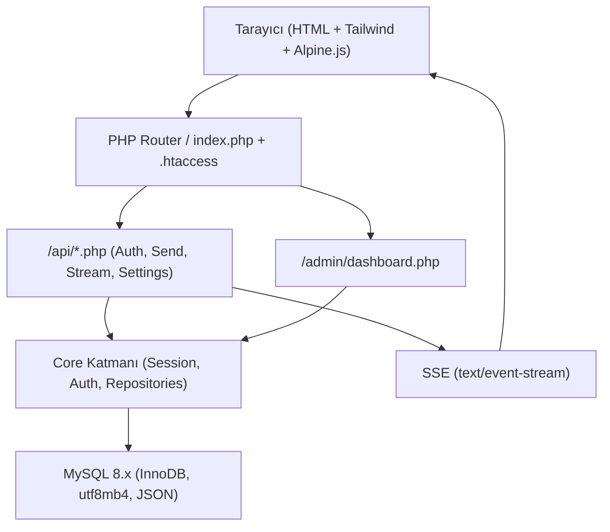
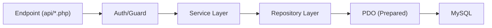
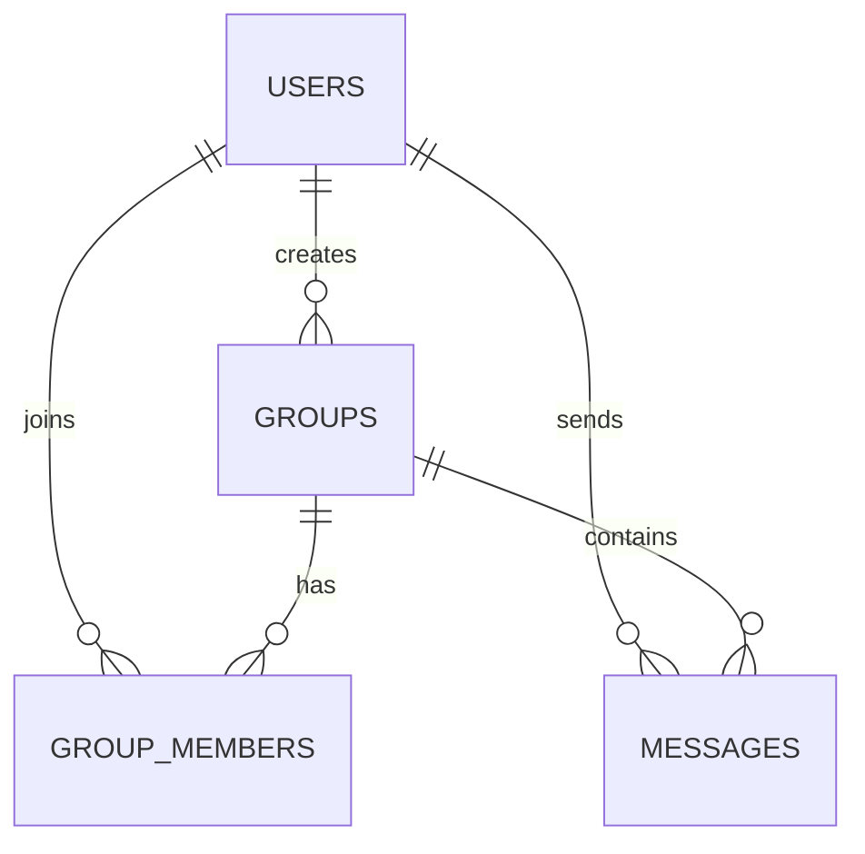

## 1. Mimari Tasarım



## 2. Teknoloji Tanımı
- Backend: PHP 8.2+ (OOP, MVC esintili katmanlama), PDO (prepared statements)
- Veritabanı: MySQL 8.x, InnoDB, utf8mb4, JSON kolonları
- Gerçek zamanlı: PHP Server-Sent Events (SSE) üzerinden tek yönlü stream
- Frontend: HTML5 + Tailwind CSS + Alpine.js + CSS transitions/animate.css
- Dağıtım hedefi: cPanel / public_html altına direkt kopyala-çalıştır
- Domain ve güvenlik: chat.emrecloud.com.tr baz alınarak cookie/session ve yönlendirme

## 3. Route Tanımları
| Route | Amaç |
|------|------|
| / | Ana sohbet arayüzü (public kanallar varsayılan) |
| /admin | Admin panel giriş/ana ekran (yetkili değilse 403/redirect) |
| /api/auth.php | Kayıt, giriş, misafir session üretimi, çıkış |
| /api/stream.php | SSE akışı (mesajlar, sistem eventleri, typing) |
| /api/send.php | Mesaj gönderme + durum güncelleme |
| /api/settings.php | Kullanıcı ayarlarını JSON olarak kaydet/oku |

## 4. API Tanımları (İç Endpointler)

### 4.1 Ortak Kurallar
- Tüm JSON endpointleri: `Content-Type: application/json; charset=utf-8`
- Session: PHP native session; cookie domain: `chat.emrecloud.com.tr`, `Secure`, `HttpOnly`, `SameSite=Lax` (login gerektiren aksiyonlarda CSRF token ile güçlendirilir)
- Rate limit: IP bazlı basit limit (özellikle auth ve send)
- Input doğrulama: server-side zorunlu; mesaj uzunluğu, handle formatı, grup izinleri

### 4.2 /api/auth.php
**POST action=guest**
- Amaç: Misafir session + handle üretimi
- Response:
```json
{ "ok": true, "user": { "isGuest": true, "handle": "@Kozmik_Yolcu_42" } }
```

**POST action=register**
- Body:
```json
{ "username": "emre", "email": "a@b.com", "password": "********", "phone": null }
```
- Response:
```json
{ "ok": true, "user": { "id": 123, "handle": "@emre" } }
```

**POST action=login**
- Body:
```json
{ "identifier": "a@b.com", "password": "********" }
```

**POST action=otp_start / otp_verify (simüle)**
- otp_start: telefon numarası kaydı başlatır ve “fake” OTP üretir (UI’da gösterilir veya loglanmadan session’da tutulur)
- otp_verify: session’daki OTP ile eşleştirir

**POST action=logout**

### 4.3 /api/send.php
**POST**
- Body:
```json
{
  "target": { "type": "group", "groupId": 10 },
  "text": "Merhaba @emre"
}
```
veya
```json
{
  "target": { "type": "dm", "receiverId": 55 },
  "text": "Selam"
}
```
- Response:
```json
{ "ok": true, "messageId": 999, "createdAt": "2026-06-15 12:34:56" }
```

**POST action=ack**
- Amaç: delivered/read güncelleme
- Body:
```json
{ "messageId": 999, "status": "read" }
```

### 4.4 /api/stream.php (SSE)
**GET**
- Query:
  - `scope=group&group_id=10` veya `scope=dm&peer_id=55`
  - `last_event_id` veya `Last-Event-ID` header desteği
- Headers:
  - `Content-Type: text/event-stream`
  - `Cache-Control: no-cache`
  - `Connection: keep-alive`
- Event örnekleri:
  - `event: message` → yeni mesaj payload
  - `event: presence` → aktif kullanıcı sayısı / room metrikleri
  - `event: typing` → typing simülasyonu (opsiyonel)
  - `event: heartbeat` → bağlantı canlı tutma

### 4.5 /api/settings.php
**GET**
- Response:
```json
{ "ok": true, "settings": { "theme": "dark_blue", "fontScale": 1.0, "wallpaper": "pattern_01", "sounds": true } }
```
**POST**
- Body: settings JSON (whitelist alanlar)

## 5. Sunucu Katmanı (Önerilen İç Mimari)



- Endpoint: sadece input parse + auth guard + service çağrısı + response üretimi
- Service: iş kuralları (grup izinleri, handle üretimi, status geçişleri)
- Repository: SQL ve veri erişimi (index kullanımını gözeten sorgular)

## 6. Veri Modeli

### 6.1 ER Diyagramı


### 6.2 DDL (Tablolar + İndeksler)
```sql
CREATE TABLE users (
  id BIGINT UNSIGNED NOT NULL AUTO_INCREMENT,
  username VARCHAR(32) NOT NULL,
  email VARCHAR(190) NULL,
  password_hash VARCHAR(255) NULL,
  phone VARCHAR(32) NULL,
  avatar VARCHAR(255) NULL,
  role ENUM('user','admin') NOT NULL DEFAULT 'user',
  settings_json JSON NULL,
  created_at DATETIME NOT NULL DEFAULT CURRENT_TIMESTAMP,
  PRIMARY KEY (id),
  UNIQUE KEY uq_users_username (username),
  UNIQUE KEY uq_users_email (email),
  UNIQUE KEY uq_users_phone (phone),
  KEY ix_users_role_created (role, created_at)
) ENGINE=InnoDB DEFAULT CHARSET=utf8mb4 COLLATE=utf8mb4_unicode_ci;

CREATE TABLE groups (
  id BIGINT UNSIGNED NOT NULL AUTO_INCREMENT,
  name VARCHAR(80) NOT NULL,
  slug VARCHAR(96) NOT NULL,
  description VARCHAR(255) NULL,
  type ENUM('public','private') NOT NULL DEFAULT 'public',
  created_by BIGINT UNSIGNED NOT NULL,
  created_at DATETIME NOT NULL DEFAULT CURRENT_TIMESTAMP,
  PRIMARY KEY (id),
  UNIQUE KEY uq_groups_slug (slug),
  KEY ix_groups_type_created (type, created_at),
  KEY ix_groups_created_by (created_by),
  CONSTRAINT fk_groups_created_by FOREIGN KEY (created_by) REFERENCES users(id) ON DELETE RESTRICT
) ENGINE=InnoDB DEFAULT CHARSET=utf8mb4 COLLATE=utf8mb4_unicode_ci;

CREATE TABLE group_members (
  id BIGINT UNSIGNED NOT NULL AUTO_INCREMENT,
  group_id BIGINT UNSIGNED NOT NULL,
  user_id BIGINT UNSIGNED NULL,
  is_guest TINYINT(1) NOT NULL DEFAULT 0,
  guest_name VARCHAR(64) NULL,
  joined_at DATETIME NOT NULL DEFAULT CURRENT_TIMESTAMP,
  PRIMARY KEY (id),
  UNIQUE KEY uq_group_member_user (group_id, user_id),
  KEY ix_group_members_group (group_id, joined_at),
  KEY ix_group_members_guest (group_id, is_guest, joined_at),
  CONSTRAINT fk_group_members_group FOREIGN KEY (group_id) REFERENCES groups(id) ON DELETE CASCADE,
  CONSTRAINT fk_group_members_user FOREIGN KEY (user_id) REFERENCES users(id) ON DELETE SET NULL
) ENGINE=InnoDB DEFAULT CHARSET=utf8mb4 COLLATE=utf8mb4_unicode_ci;

CREATE TABLE messages (
  id BIGINT UNSIGNED NOT NULL AUTO_INCREMENT,
  sender_id BIGINT UNSIGNED NULL,
  is_guest_sender TINYINT(1) NOT NULL DEFAULT 0,
  guest_name VARCHAR(64) NULL,
  receiver_id BIGINT UNSIGNED NULL,
  group_id BIGINT UNSIGNED NULL,
  message_text TEXT NOT NULL,
  status ENUM('sent','delivered','read') NOT NULL DEFAULT 'sent',
  created_at DATETIME NOT NULL DEFAULT CURRENT_TIMESTAMP,
  PRIMARY KEY (id),
  KEY ix_messages_group_time (group_id, created_at),
  KEY ix_messages_receiver_time (receiver_id, created_at),
  KEY ix_messages_sender_time (sender_id, created_at),
  KEY ix_messages_status_time (status, created_at),
  CONSTRAINT fk_messages_sender FOREIGN KEY (sender_id) REFERENCES users(id) ON DELETE SET NULL,
  CONSTRAINT fk_messages_receiver FOREIGN KEY (receiver_id) REFERENCES users(id) ON DELETE SET NULL,
  CONSTRAINT fk_messages_group FOREIGN KEY (group_id) REFERENCES groups(id) ON DELETE CASCADE
) ENGINE=InnoDB DEFAULT CHARSET=utf8mb4 COLLATE=utf8mb4_unicode_ci;

CREATE TABLE banned_ips (
  id BIGINT UNSIGNED NOT NULL AUTO_INCREMENT,
  ip_address VARCHAR(64) NOT NULL,
  reason VARCHAR(255) NULL,
  expires_at DATETIME NULL,
  PRIMARY KEY (id),
  UNIQUE KEY uq_banned_ips_ip (ip_address),
  KEY ix_banned_ips_expires (expires_at)
) ENGINE=InnoDB DEFAULT CHARSET=utf8mb4 COLLATE=utf8mb4_unicode_ci;
```

## 7. SSE (cPanel) Operasyonel Notlar
- PHP output buffering kapatılır; mümkünse `fastcgi_finish_request` kullanılmaz; periyodik `heartbeat` gönderilir
- Zaman aşımları: server limitlerine göre 25–55 saniyede bir ping; istemci otomatik reconnect
- Ölçek: Çok yüksek eşzamanlı kullanıcı için “fan-out” maliyeti artar; ilk sürüm için “room bazlı polling + SSE” hibriti opsiyonel bir fallback olarak tasarlanabilir

## 8. Güvenlik Notları (Minimum Baseline)
- Session cookie: `Secure`, `HttpOnly`, `SameSite=Lax`, domain ve path doğru set edilir
- CSRF: state-changing endpointlerde token (özellikle settings, send, admin)
- XSS: mesaj render’ı HTML escape; link preview whitelist/kapalı
- SQLi: sadece prepared statements; text arama/handle arama için normalize edilmiş sorgular
- Admin: rol kontrolü + brute-force limit + opsiyonel 2FA (sonra)
